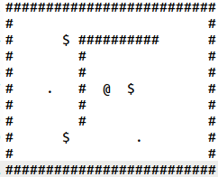

# projet sokoban

### Documentation Doxygen de Sokoban:
- pour plus details consulter : <a href="https://project1sokoban1gamel2.on.drv.tw/Sokoban/html/"> documentation sokoban </a>

## c'est quoi le sokoban ?
- preview du jeu :  

  

- lien vers la page wikipedia du jeu : <a href="https://fr.wikipedia.org/wiki/Sokoban">sokoban </a>

***
## comment jouer ?

 <ol> <li> Execute le fichier "sokoban.sh" avec la command <u> bash sokoban.sh </u> sur un terminal ubuntu. </li><li>
Après la creation de certains fichiers dans votre repetoire courant, taper la command <u> ./bin/main </u> pour lancer le jeu. </li>
>> <b>NOTE</b>: le script sokoban.sh install dans votre machine, d'apres la command sudo, tous ce qui est essentiel pour le jeu et sa documentation Doxygen (à savoir graphiz et Doxygen).
<li> suivre les intructions afficher et clicker sur ENTRER pour appliquer le déplacement du Player. </li>
</ol> 

***
## comment on a réalisé ce projet Sokoban (Partie 1)?
- Langague utilisé : langage C
- outils appliqués : Doxygene et un fichier markdown
- La structure de donne optée pour approché le probleme : 
 <ol> <li>
on represente, la grille du sokoban qu'on joue sur, par un tableau unidimensionnel qu'on l'affichera sous forme d'une 
grille double dimension,  et deux entiers qui representent les dimensions de la grille.</li> <li>
la grille affichée et d'origine un ficher <b>.txt</b> : 

 
 
<u><b>legende</b></u> : 
 

'#' représente un mur. 
 

'$' représente un cube. 
 

'@' représente votre personnage. 
 

'.' représente un objectif. (l'endroit ou on doit placer les cubes pour gagner) 
 

' ' représente du vide dans lequel votre personnage et les cubes pourront progresser.
 
</li> </ol>

- l'extraction de la grille (du fichier .txt) et son affichage : 
 <ol> <li> par la fonction init_level(). (voir description des fonctions)</li> <li>
par la fonction display(). (voir description des fonctions)</li> 
</ol>

- deplacer le joueur : 
 <ol> <li> Trouver les coordoonées du Player dans la grille.
Cela est fait dans la fonction init_level(). </li> <li>
Mettre à jour les coordoonées du Player selon la direction entrée par l'utilisateur. Voir description de la fonction move_player(). </li> <li>
En fin l'affichage de la grille après la mise à jour du Player par la fonction display() utiliser à la fin de move_player().</li></ol>

***
## les fichiers principeaux.
- <b>Sources:</b> <ol>
<li>main.c</li>
<li>player.c</li>
<li>grid.c</li></ol>

- <b>Headers:</b> <ol>
<li>player.h</li>
<li>grid.h</li></ol>

***
## Les obstacles qu'on a surmonté.
- <b>les obstacles de programmation</b>:
<ol><li> La mise à jour des coordoonées du Player après le mouvement: Player existe dans un tableau (unidimensionnel), son deplacement necessite de tenir compte le changement qui sera lieu dans l'affichage de la grille (bidimensionnel). Par exemple si Player se deplace en 'HAUT' (dans la grille 2D), ce meme Player se deplace d'une valeur '-row' dans le tableau 1D.
> Donc il foudra trouver une fonction qui lie entre le deplacement de 2D en 1D. (voir le source de player.c)</li>
<li> La perte des charactères (les entités) de la grille pendant le deplacement du Player: quand Player passe par un GOAL par exemple, cet entité se fait remplacer par l'entité NONE, ce qui supprime GOAL de la Grille.
> Solution opté: utilisé un variable global (enum CaseType entite dans player.c) de valeur NONE par defaut, qui enregistre chanque entité passée par Player afin qu'on le supprime pas.</li></ol>

- <b> Les obstacles d'organisation: </b> <ol><li> mettre chaque ficher dans un dossier afin de les filtrés selon leurs extensions: Exemple *.c dans le rep src/. Ce qui a causé d'autres probelèmes de compilation et de documentation.</li>
<li> Ameliorer le Makefile: arriver à compiler tous les fichiers (chacun dans son rep) avec une syntax de Makefile plus evoluée pour des raisons d'optimisation.</li></ol>

- <b> Les obstacles de la Documentation: </b> <ol><li> Activation des Options du Doxyfile pour une bonne affichage de la Doc. </li>
<li> Affichage des images sur la Documentation Doxygen: l'execution du script sokoban.sh crée une documentation HTML dans le rep doc/, mais par consequence les images ne s'affichent pas sur Doxygen (gitlab OUI), parceque les images que se fichier HTML affichent sont que qui sont dans le rep Doc/.</li>
> Solution opté: integrer une command dans le fichier <u>Makefile</u> qui copie le rep img/ dans le rep doc/ afin que le fichier HTML le trouve et l'affiche. (cp -r img/ doc/)</ol>

***
- <b>réalisé par</b> :
    <ul>
    <li> Mohammed chahbaoui</li>
    <li> Mohammed yassine Azaza </li>  
    <u> L2 informatique - tech de dev.</u>
    </ul>
